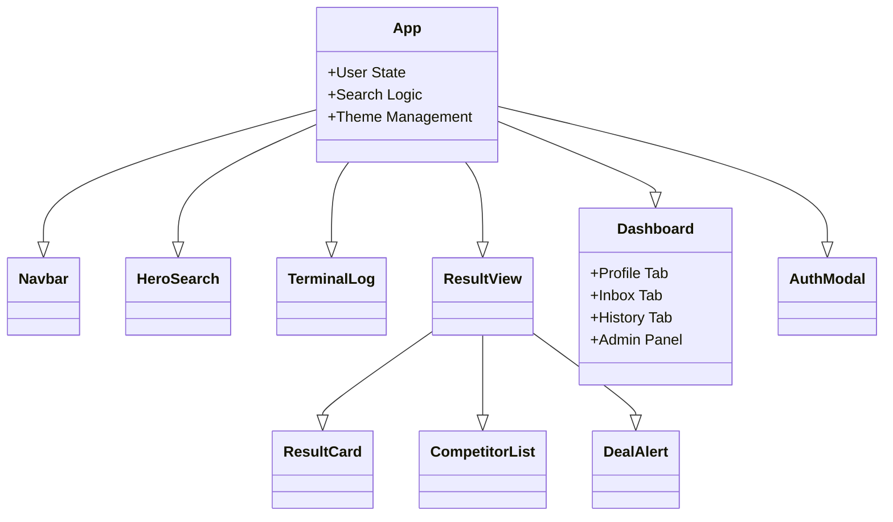

# 🏗️ Technical Architecture & Data Flow

This document details the inner workings of CodeSniper. It is designed to help developers (and AI assistants) understand the state management and logic flow.

## 1. The "Hybrid" Simulation Model
CodeSniper currently operates in a **Client-Side Simulation Mode**.
*   **Real Data**: The "Search" results are REAL. We use the Gemini API to fetch actual URLs and codes from the web.
*   **Simulated Infrastructure**: User accounts, database saving, and the "Headless Browser Validation" steps are simulated using JavaScript timers and probability math.

## 2. Component Hierarchy



## 3. The Search Pipeline (`handleSearch`)

The core function of the app follows this strict sequence:

1.  **Gatekeeping**:
    *   Check if User is logged in.
    *   Check `dailySearchesUsed` vs `dailySearchLimit`.
2.  **Phase 1: Planning (Gemini)**:
    *   Send query + Region to `GeminiService.planSearch()`.
    *   Gemini uses `googleSearch` tool to find the merchant URL and candidate codes.
    *   Returns a JSON object with `suggestedCodes` and `competitors`.
3.  **Phase 2: Scanning (Visuals)**:
    *   The App iterates through a list of "fake" sources (e.g., "Deep Web", "Discord").
    *   It updates the `TerminalLog` to build suspense.
4.  **Phase 3: Validation (Heuristics)**:
    *   For each code returned by Gemini, the App "rolls the dice" based on the `likelySuccessRate`.
    *   If successful -> Added to `validatedCodes`.
    *   If failed -> Discarded (hidden from user).
5.  **Phase 4: Result**:
    *   Results are rendered.
    *   Search is saved to `History`.

## 4. Data Models

### User Object
```typescript
interface User {
  id: string;
  plan: 'free' | 'pro';
  credits: number;
  referralCode: string; // "SNIPER-123"
  isVerified: boolean;
  dailySearchLimit: number; // 15 (Free) vs 1000 (Pro)
}
```

### Search Result
```typescript
interface SearchResult {
  merchantName: string;
  codes: CouponCode[];
  competitors: Competitor[];
  stats: {
    moneySavedEstimate: string;
    timeTaken: string;
  };
}
```
