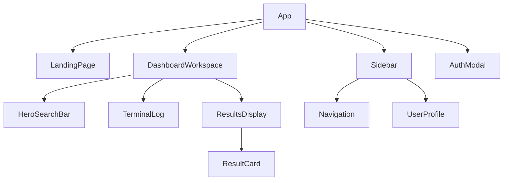

# 🏗️ Technical Architecture & Data Flow: Hunter Protocol

This document details the inner workings of Discount Hunter AI. It is designed to help developers (and AI assistants) understand the SaaS-style conversion funnel and the new "Hunter Protocol" center-focused architecture.

## 1. The SaaS Conversion Funnel
The application is structured as a two-stage funnel:
1.  **Public Layer (`LandingPage`)**: High-energy Cyber-Tech hero section designed to convert visitors into operatives. No search inputs are available here.
2.  **Authenticated Layer (`DashboardWorkspace`)**: The central hub for authenticated operatives. Features a center-focused search interface and terminal logging.

## 2. Component Hierarchy

## 3. The "Hunter Protocol" Search Pipeline
The core functionality follows a personality-driven sequence:

1.  **Deployment**: Operative enters a target (Merchant URL/Name) and optional Location.
2.  **Breach (Planning)**: Gemini AI identifies the target and maps the extraction route.
3.  **Raid (Scanning)**: The system simulates "raiding" shadow networks and Discord voids.
4.  **Extraction (Validation)**: Artificial intelligence verifies code validity with high confidence.
5.  **Exfiltration (Result)**: Validated codes are presented in the central workspace and archived to the user's Inbox.

## 4. UI/UX: Cyber-Tech Aesthetic
The app uses a strict "Cyber-Tech" design system defined in `src/index.css`:
*   **Colors**: Hunter Surface (`#0A0A0F`), Neon Cyan (`#00F0FF`), Neon Purple (`#A855F7`).
*   **Utilities**: `cyber-glass` (backdrop blur + neon border), `cyber-grid` (retro background grid), `animate-scan` (moving scanning line).
*   **Animations**: Framer Motion is used for all transitions, emphasizing "deployment" and "glitch" effects.

## 5. State Management
*   **Active Tab**: Controls the main content area in the `DashboardWorkspace` (Overview, Inbox, History, Account).
*   **Hunter Personality**: Logs are injected with "Aggressive AI" terminology (e.g., "RAIDING", "TARGET COMPROMISED").
