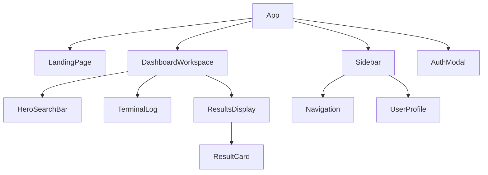

# Technical Architecture & Data Flow: Hunter Protocol

This document describes Discount Hunter AI’s conversion funnel and UI hierarchy.  
**Reality check**: launch features on [PR #1](https://github.com/Bigc7292/Discount-Hunter-Ai/pull/1)–[#4](https://github.com/Bigc7292/Discount-Hunter-Ai/pull/4) are **on PR branches / pending merge** — not assumed present on `main`.

**Invariant**: never surface untested/unverified codes (UI enforcement: PR #4, pending merge).  
**Data**: Firebase Auth + Firestore only (no Supabase).  
**Bot email**: AgentMail `discount-hunter@agentmail.to` only (PR #3, pending merge).

## 1. The SaaS Conversion Funnel
1. **Public Layer (`LandingPage`)**: Marketing / conversion. Optional Verified Checkout Ledger surface lands with PR #2 (pending merge).
2. **Authenticated Layer (`DashboardWorkspace`)**: Search, terminal log, results, inbox/history (Firestore persist on PR #1, pending merge).

**Monetisation**: optional $49 LTD Stripe Checkout (PR #1, pending merge). Longer-term research: freemium + ~$24/yr primary.

## 2. Component Hierarchy

```mermaid
graph TD
    App --> LandingPage
    App --> DashboardWorkspace
    App --> Sidebar
    App --> AuthModal
    
    DashboardWorkspace --> HeroSearchBar
    DashboardWorkspace --> TerminalLog
    DashboardWorkspace --> ResultsDisplay
    
    ResultsDisplay --> ResultCard
    
    Sidebar --> Navigation
    Sidebar --> UserProfile
```

Pricing / Stripe modal and ledger components ship on PR #1 / #2 branches (pending merge).

## 3. Search Pipeline (current intent)
1. **Deploy**: Operative enters merchant + optional location.
2. **Discover**: Multi-source **candidate** pool only (Serper / Jina / Agent-Reach / Tavily; Zernio optional when keyed; Firecrawl ready but not yet orchestrated) — see **[DISCOVERY_WORK_TREE.md](./DISCOVERY_WORK_TREE.md)**. Candidates are **never** user-facing alone.
3. **Verify**: Backend checkout simulation (Puppeteer ± geo proxies).
4. **Display**: **Verified-only** results — no unverified/social codes in UI. **CORE LAW**: never surface unverified codes.
5. **Persist**: Inbox / history via Firestore when PR #1 merges; AgentMail for merchant OTP stub when PR #3 merges.

## 4. UI/UX: Cyber-Tech Aesthetic
Defined in `src/index.css`:
* **Colors**: Hunter Surface (`#0A0A0F`), Neon Cyan (`#00F0FF`), Neon Purple (`#A855F7`).
* **Utilities**: `cyber-glass`, `cyber-grid`, `animate-scan`.
* **Animations**: Framer Motion for transitions / glitch effects.

## 5. State Management
* **Active Tab**: Overview, Inbox, History, Account in `DashboardWorkspace`.
* **Auth / profile**: Firebase; lifetime entitlement fields arrive with PR #1 (pending merge).
* **Shipping**: `gh` only — CloudAgent unavailable on plan.

See [DISCOVERY_WORK_TREE.md](./DISCOVERY_WORK_TREE.md) for discovery stages & API keys; [AGENTS.md](./AGENTS.md) for service diagram; [MIGRATION_TODO.md](./MIGRATION_TODO.md) for DoD checklist.
